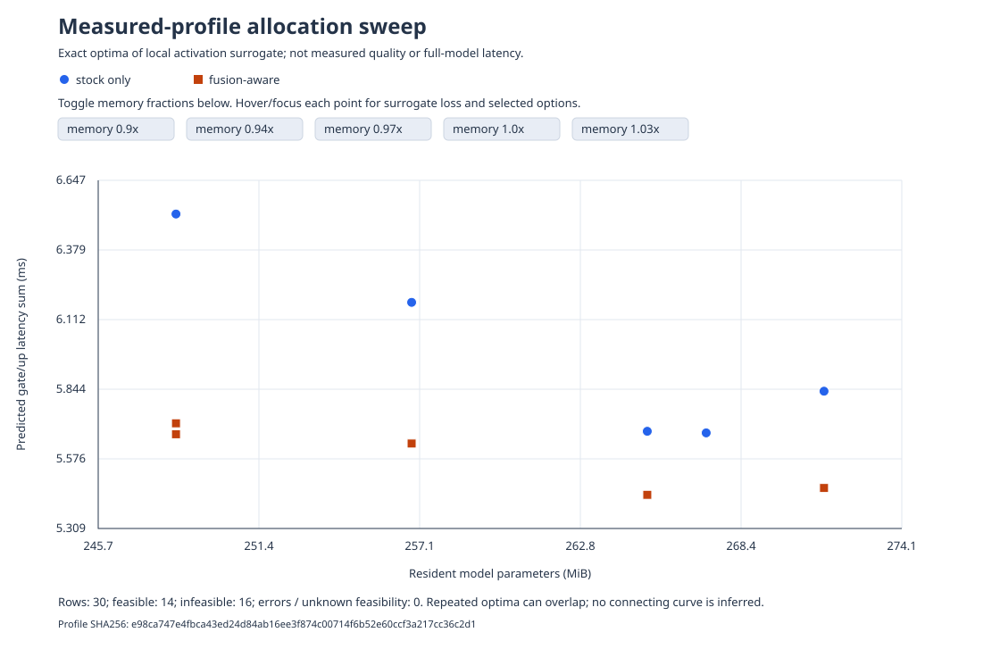

# ParetoQuant-Metal

Hardware-aware mixed-precision LLM quantization and fused Metal decode kernels for Apple Silicon.

An ML systems project: calibration, a constrained precision allocator, packed GPU kernels,
shape-specific launch tuning, model serialization, and reproducible end-to-end measurements.
Built on MLX/MLX-LM; this is not a new model or a claim to have invented mixed precision.

## Verified results, not projections

Measured on an Apple M2 Pro with 16 GB unified memory using Qwen2.5-0.5B-Instruct
and Qwen2.5-1.5B-Instruct. Precision allocation and custom-kernel dispatch are separate:
a larger model can benefit from reduced storage while correctly selecting stock execution.

### Parameter storage and held-out quality

| Model | Uniform affine4 MiB | Mixed MiB | Reduction | Mixed gate/up pairs |
|---|---:|---:|---:|---|
| Qwen2.5-0.5B | 265.12 | 248.49 | 6.27% | 16 three-bit, 8 four-bit |
| Qwen2.5-1.5B | 828.31 | 775.81 | 6.34% | 16 three-bit, 12 four-bit |

6-bit is supported and roundtrip-tested, but was not selected in these two plans.
Other eligible model weights remain 4-bit. Bytes include quantization metadata,
not activations, KV cache, or total process memory.

Actual stock-MLX likelihood on the first **16,384 next-token targets of the WikiText-2
raw test export**, window length 512, stride 256:

| Model | FP16 reference PPL | Uniform affine4 PPL | Mixed PPL |
|---|---:|---:|---:|
| Qwen2.5-0.5B | 13.9580 | 16.5769 | 18.4092 |
| Qwen2.5-1.5B | 9.2681 | 10.5778 | 11.5199 |

This is **noncanonical bounded-context test-prefix perplexity**, not full WikiText
benchmark equivalence or task accuracy. The extra storage reduction costs about
11.1% / 8.9% higher PPL versus uniform4; it is not lossless compression.
Dataset revision, exact corpus/token hashes, all 64 scoring-window audits per variant,
and model fingerprints are archived in [`results/quality-wikitext-prefix16384-v1/`](results/quality-wikitext-prefix16384-v1/).
Protocol: [`docs/QUALITY.md`](docs/QUALITY.md).

### Fusion: historical gain, parity rerun, and fresh retuning

The original same-weight replay used 21 paired trials per context and 64 cached decode
steps per trial. Only the gate/up execution backend changed:

| Context | Prompt tokens | Stock tok/s | Fused tok/s | Ratio | Paired bootstrap 95% interval |
|---|---:|---:|---:|---:|---|
| short | 35 | 212.74 | 221.73 | 1.042x | [1.036, 1.057] |
| medium | 109 | 209.88 | 220.22 | 1.049x | [1.039, 1.060] |
| long | 448 | 206.03 | 213.12 | 1.034x | [1.027, 1.048] |

The October 4 release rerun of the same saved weights and legacy dispatch observed
only **1.008–1.009x**, with all paired bootstrap intervals containing 1.0:
short [0.988, 1.024], medium [0.981, 1.022], long [0.994, 1.019].
It therefore **does not establish a reproducible end-to-end fusion speedup**.
Both runs remain visible; raw rerun: [`results/m2pro-paired-release-v4/`](results/m2pro-paired-release-v4/).
On the 1.5B shape, tuning selected zero custom fused pairs: a valid stock fallback,
not a claim that the kernel scales universally.

Fresh retuning on the **unchanged saved weights** checked all 64 captured inputs
per pair and selected 18 fused pairs, rejecting eight numerically invalid launches
across two layers. A subsequent 21-paired-trial replay measured:

| Context | Stock/fused latency ratio | Paired bootstrap 95% interval |
|---|---:|---|
| short | 1.037006x | [1.021699, 1.050716] |
| medium | 1.041444x | [0.999557, 1.054900] |
| long | 1.050541x | [1.034338, 1.065620] |

Short and long intervals exclude parity; medium does not. Retuning restored an
observed benefit on this workload, not a universal or fixed-dispatch guarantee.
[Retuning method](docs/RETUNING.md) · [Exact replay evidence](results/m2pro-paired-retuned-v5/)
· [Measurement ledger](docs/MEASUREMENTS.md).

These are synchronized teacher-forced wall-clock measurements, not GPU-only times or
general speedup guarantees. Token sampling and text rendering are excluded.
The intervals describe sampled trials on this machine, not other models or workloads.

### Compiled full-model decode (opt-in)

An explicit-state compiled decoder adds fixed-shape KV updates and dynamic RoPE
positions without changing the saved weights or precision map. Stock and custom
MLP paths receive identical cache/compilation treatment.

Two separately executed six-path experiments each retained 24 paired trials per
context and 64 teacher-forced decode steps. The later run measured:

| Context | Stock eager tok/s | Fused compiled tok/s | Combined ratio | Paired bootstrap 95% interval |
|---|---:|---:|---:|---|
| short | 207.99 | 267.28 | 1.285094x | [1.267641, 1.301666] |
| medium | 208.43 | 262.83 | 1.261018x | [1.238254, 1.286979] |
| long | 203.15 | 256.51 | 1.262617x | [1.249584, 1.275418] |

Combined throughput increased 26.1–28.5% versus eager stock in this run; versus
our existing retuned eager path, 21.2–22.8%. Custom fusion alone added 6.8–7.7%
over **equally compiled stock**, not the entire combined gain. Native/compiled
32-token autoregressive sequences matched within each backend in all three cases.
The first run's combined ratios were 1.274048x / 1.261557x / 1.236711x and remain
archived. These are warmed teacher-forced decode results: first compilation,
prefill/cache setup, sampling and rendering are excluded. They do not establish
cold-request acceleration or a new engine-comparison result.
[Method and controls](docs/COMPILED_DECODE.md) · [First run](results/m2pro-compiled-paired-v1/)
· [Second run](results/m2pro-compiled-paired-v2/).

A separate **actual autoregressive request** check against native MLX-LM (12 paired
requests/path/context, 64 generated tokens, prefill/sampling/text decoding included,
models already loaded and compiled decoder reused) found much smaller incremental
gains over our existing fused generator: short 1.021511x [1.014905,1.027051],
medium 1.007712x [1.004304,1.011335], long 1.003929x [0.998911,1.006193].
Long includes parity. Combined fused+compiled versus native stock was 1.094577x /
1.081632x / 1.059324x; **the 26–29% cached-decode gain is not real-request speed**.
Native MLX-LM already overlaps token work. Matching its separately processed final
prompt token was necessary to preserve native/compiled tokens within each backend.
[Practical evidence](results/m2pro-compiled-autoregressive-v2/).

### Practical engine comparison

Seven warm sequential-block trials per prompt, 64 actual generated tokens per trial.
Median client wall-clock tokens/second on the 0.5B checkpoint:

| Prompt tokens | ParetoQuant | Stock MLX | vLLM Metal | TensorFlow hybrid graph |
|---:|---:|---:|---:|---:|
| 48 | 295.78 | 261.98 | 232.46 | 10.81 |
| 99 | 278.04 | 257.28 | 217.55 | 10.67 |
| 209 | 257.71 | 236.12 | 194.52 | 10.52 |

Project and stock MLX used identical saved mixed weights; the vLLM server was launched
against that same local checkpoint and its API reported the expected root/context.
This is not an attestation of the server's loaded weight bytes. Serving overhead,
interpreter/library versions, and sequential-block drift differ; this is not isolated
kernel acceleration, CUDA vLLM, or a batching comparison. TensorFlow used native KerasHub
Qwen graph generation, nonquantized FP16, and CPU cache updates with Metal forwards:
not precision-matched and not a generic TensorFlow speedup claim. Earlier Ollama results
used different quantization. Full protocol: [`results/framework-head-to-head-v1/report.md`](results/framework-head-to-head-v1/report.md).

The original executed scripts are archived byte-exactly beside these historical results.
They predate strict manifest/server admission and are evidence only, not recommended
live entry points. Current `spikes/` runners require a bound checkpoint (`--model`)
and reject stale dispatch; server settings not observable through its API are labeled
unverified rather than asserted. See [`docs/MEASUREMENTS.md`](docs/MEASUREMENTS.md).

### Explore the precision/execution Pareto tradeoff

The exact CPU-only sweep evaluated 60 budget/strategy combinations across both sizes.
It distinguishes infeasibility from frontier-cap errors, includes fixed parameter bytes,
and retains every selected precision/backend. Surrogate loss and summed isolated latency
are explicitly not full-model quality and latency measurements.



Open the SVG directly for fraction toggles and per-point loss/selection tooltips.
[1.5B plot](results/portfolio-sweep-1.5b-v1/frontier.svg) · [Sweep protocol](docs/SWEEP.md).

Raw measurements and plans: [`results/`](results/).
The first scalar kernel's slower results are retained, rather than hidden.
The optimized kernel consumes entire packed words/bytes and amortizes scale/bias application.

## Quick start

Use native arm64 Python on an Apple Silicon Mac. Dependencies are locked in `uv.lock`.

```sh
uv sync --frozen --extra dev
uv run paretoquant doctor
uv run pytest -q
uv run ruff check src tests
```

`doctor` must show an Apple Silicon Metal device. Do not use an Intel/Rosetta interpreter.
CPU allocator/statistics tests can run without MLX; Metal-dependent tests skip when unavailable.
GitHub CPU CI is verified on Ubuntu with Python 3.11 and 3.13 (tests, lint, distribution build).
Metal execution and real-checkpoint inference are separately verified locally on the M2 Pro.

### Download a small full-precision reference

Check RAM, swap, and disk before downloading. The verified reference weight file is
988,097,824 bytes, plus tokenizer/configuration files. The pipeline currently needs the
unquantized reference to fit during calibration; it is not a layer-sharded converter.

```sh
uv run hf download Qwen/Qwen2.5-0.5B-Instruct \
  --local-dir models/qwen2.5-0.5b-instruct \
  --include '*.json' '*.safetensors' merges.txt vocab.json LICENSE README.md
```

Verified source weight SHA-256:
`fdf756fa7fcbe7404d5c60e26bff1a0c8b8aa1f72ced49e7dd0210fe288fb7fe`

The CLI accepts local directories only and does not enable remote model code.

### Reproduce mixed precision and ablations

```sh
uv run paretoquant run \
  --model models/qwen2.5-0.5b-instruct \
  --output artifacts/my-mixed-run \
  --memory-budget-mib 249.21 --latency-factor 1.15 \
  --profile-repeats 30 --decode-steps 48 --decode-repeats 7 \
  --max-states 20000
```

The output directory must be new or empty. The command writes:

- `profile.json`: actual parameter bytes, calibration error, raw kernel tuning/validation samples.
- `plans.json`: exact solutions to the supplied surrogate-cost allocation problem.
- `results.json` / `report.md`: held-out smoke NLL, model timings, environment, and limitations.
- `model/`: runnable packed weights, per-module precision config, tokenizer, and dispatch manifest.

A tight or impossible budget fails explicitly. Frontier overflow raises an error rather than
silently claiming an approximate solution is exact.
`--latency-factor` constrains the sum of isolated gate/up timings, not full-model latency.

### Generate from the saved model

```sh
uv run paretoquant generate --model artifacts/my-mixed-run/model \
  --prompt 'Explain why a mutex prevents a data race.' --max-tokens 64
uv run paretoquant generate --model artifacts/my-mixed-run/model \
  --prompt 'Explain why a mutex prevents a data race.' --max-tokens 64 --stock
# Optional full-model compiled decode; cold compilation is not a speed guarantee:
uv run paretoquant generate --model artifacts/my-mixed-run/model \
  --prompt 'Explain why a mutex prevents a data race.' --max-tokens 64 --compiled
```

The runtime falls back to stock execution for multi-token prefill and unsupported decode
input dtypes. Saved performance dispatch is used only when hardware/runtime metadata and SHA-256
bindings for every weight shard, configuration, and shipped kernel match. Invalid,
changed, or legacy-v1 manifests fall back explicitly to stock generation; replay
fails closed. Seals detect changes, not authorship or benchmark freshness.

Migrate an existing legacy saved model without modifying the original:

```sh
uv run paretoquant seal --model artifacts/m2pro-mixed-v2/model \
  --output artifacts/my-sealed-model
```

Sealing preserves the original profile metadata and records that no new profiling
was performed. The output must be a new directory outside the source.

### Run the larger-model experiment with bounded residency

After separately downloading the pinned Qwen2.5-1.5B reference (source revision and
weight hash are in `results/m2pro-1.5b-mixed-v2/`):

```sh
uv run python scripts/run_scaling.py profile \
  --model models/qwen2.5-1.5b-instruct --output artifacts/my-1.5b-profile \
  --profile-repeats 20
uv run python scripts/run_scaling.py evaluate \
  --model models/qwen2.5-1.5b-instruct --profile artifacts/my-1.5b-profile/profile.json \
  --output artifacts/my-1.5b-run --memory-fraction .94 --latency-factor 1.15 \
  --decode-steps 64 --repeats 15
```

The runner evaluates and releases one variant at a time, stores runnable uniform4
and mixed checkpoints, and verifies constructed storage against profiled byte costs.
Its variant timing blocks are not paired trials; zero selected fused pairs is valid.
This still requires the full unquantized reference to fit during calibration.

### Isolate the fusion contribution

```sh
uv run paretoquant replay --model artifacts/my-mixed-run/model \
  --output artifacts/my-paired-replay --decode-steps 64 --repeats 21
```

Replay loads two copies of the same saved precision map, alternates stock/fused timing,
checks real cached logits, retains every latency sample, and computes paired bootstrap intervals.

## Retune an existing precision map

```sh
uv run python scripts/retune_model.py --model artifacts/my-sealed-model \
  --output artifacts/my-retuned-model --repeats 20 --warmup 3 --min-improvement .05
uv run paretoquant replay --model artifacts/my-retuned-model/model \
  --output artifacts/my-retuned-replay --decode-steps 64 --repeats 21
```

Retuning copies payloads byte-for-byte, ignores stale dispatch, validates every launch
on all captured rows, and writes a fresh bound manifest. It changes execution choices,
not precision or weights. Pair-level wins still require the separate full-model replay.

## Implementation

- `allocator.py`: multiple-choice Pareto-frontier allocation under actual byte and latency budgets.
- `pipeline.py`: real layer-input capture, joint gate/up error estimation, measured candidate costs.
- `kernels/gate_up_packed.metal`: fused 3/4/6-bit affine decode with SIMD reductions and in-kernel activation.
- `metal.py`: validated packed-weight API; compiled stock and fused timing paths.
- `runtime.py`: named-module installation, prefill fallback, and execution counters.
- `evaluation.py` / `statistics.py`: held-out text NLL, fixed-token decode, and paired uncertainty estimates.
- `cli.py`: complete local-model experiment, serialization/reload, and replay commands.

Both isolated benchmark paths are compiled; the fused backend is admitted only after numerical
validation and a fresh timing split exceeds a 5% heuristic margin. That margin is not a
statistical significance test. End-to-end replay checks whether local gains survive integration.

Design and interpretation: [`docs/DESIGN.md`](docs/DESIGN.md).
Resume wording and interview preparation: [`docs/RESUME.md`](docs/RESUME.md).

## Scope and next experiments

This version demonstrates the complete path on two real Qwen2.5 model sizes. It does not yet:

- Calibrate a reference too large to fit by loading one layer/shard at a time.
- Allocate attention/down-projection precision or optimize KV-cache storage.
- Establish task accuracy on standard coding/reasoning benchmarks.
- Demonstrate 7B/14B/24B performance or beat llama.cpp.
- Provide GPU counter traces proving which part of the gain comes from kernel execution
  versus reduced host dispatch. The measured end-to-end backend gain includes both.

Those are explicit scaling/research milestones, not implied capabilities.
This code is a portfolio systems project, not a supported general-purpose inference framework.

## License and dependencies

Original project code is MIT licensed. MLX, MLX-LM, and pretrained model weights remain
under their upstream licenses; pretrained weights are not committed or included in the wheel.
